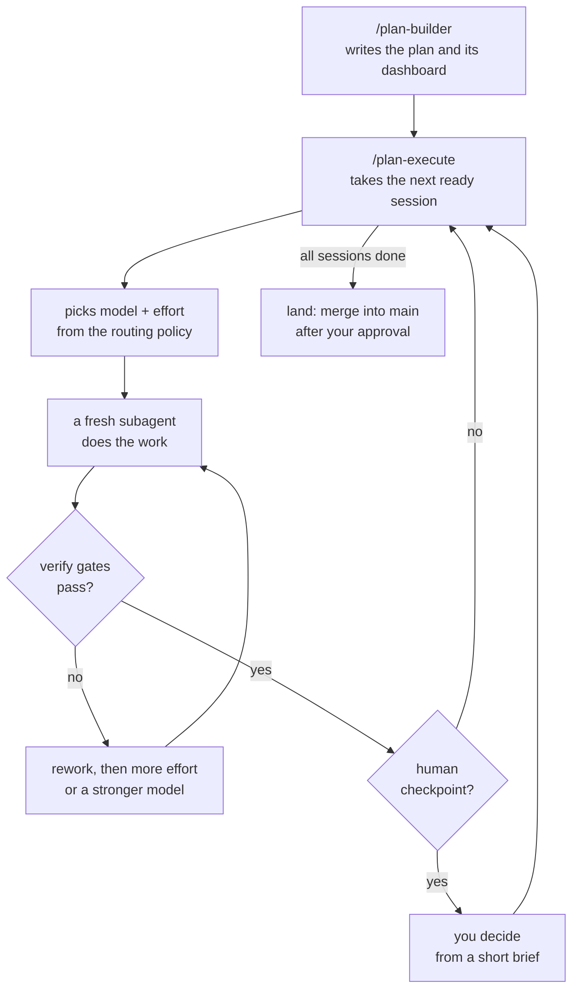

# Gearbox

**The right gear for every task.**

[](https://github.com/Autopsias/gearbox-routing/actions/workflows/verify.yml)

Gearbox is a working setup for Claude Code that you can take in parts. Its
centre is a **plan framework**: it turns a large job into a plan of sessions,
runs each session in a fresh subagent on the right model and effort, checks
each result before it counts, and stops for you where a human decision
matters. Around it sit a **model-routing policy**, **two-model code review**,
**session safety hooks** and **cost reports**.

## What Gearbox gives you

### Plan framework — large jobs as checked sessions
- `/plan-builder` interviews you and writes a plan: a dashboard (`PLAN.html`) and one prompt per session.
- `/plan-execute` runs each session in a fresh subagent, on the model and effort its task needs.
- A session counts as done only after its verify gates pass: your tests, an LLM review, or a second model.
- It stops at human checkpoints with a short decision brief, and merges into your main branch only after you approve.
- `/plan-harden` stress-tests a plan before you run it.

[How the plan framework works →](docs/PLAN-FRAMEWORK.md)

### Model routing — the right model and effort for each task
- One policy file maps five task classes, from a mechanical rename to a one-shot irreversible call, to a model tier and an effort level.
- Shipped profiles for Anthropic, OpenAI, Gemini and Z.ai. To change provider, you edit one line.
- After two failures at the same root cause, the next attempt gets more effort, then a stronger model.
- `/routing-update` updates the policy when models or prices change; `/routing-retro` checks that the routing works.

[Routing at a glance ↓](#routing-at-a-glance) · [Architecture →](ARCHITECTURE.md)

### Review and decisions
- `/adversarial-review`: Claude and OpenAI's Codex review the same code or plan separately, then the findings are merged.
- `/grill-me` interviews you about a design until each decision is settled; `/blindspot` finds the traps in unfamiliar code; `/diagnose` takes a hard bug to a fix and a test.

### Shipping and quality
- `/repo-health` scores a repo from 0 to 100 on a dashboard; `/code-quality` holds file-size and complexity limits.
- Test and CI fixers sort failures and send specialist subagents; `/ship-tail` takes a branch to a pull request with green CI, and never merges.

### Session safety
- Hooks block `git reset --hard` on uncommitted work, hold automatic compaction back until a safe moment, and queue heavy test runs.
- On macOS, a janitor cleans up leftover agent processes. A status line shows rate limits, context use and cache state.

### Cost and learning
- `/cost-audit` measures what your sessions cost, from the local transcripts.
- `/improve` looks back over your sessions and proposes rules, skills and memory. Plans write their lessons to project memory, and the next plan reads them.

There are also 52 [BMAD method](https://github.com/bmad-code-org/BMAD-METHOD)
commands and an epic builder for teams that use BMAD. Every part has a
[module card](docs/MODULES.md) with what it needs and how to install, check and
remove it.

## How a plan runs



Details, commands and costs: [The plan framework](docs/PLAN-FRAMEWORK.md).

## Routing at a glance

Each task class resolves to a model and an effort level for the active
provider. With the shipped Anthropic example profile:

| Task class | Typical work | Model · effort |
|---|---|---|
| `mechanical` | rename, format, codemod, doc edit | Claude Haiku 5.5 · low |
| `standard_build` | CRUD, wiring, templated feature | Claude Sonnet 5.5 · medium |
| `agentic_build` | multi-file change, integration, non-obvious bug | Claude Sonnet 5.5 · high |
| `deep_reasoning` | architecture, security, hard root cause | Claude Opus 5.5 · high |
| `linchpin` | a one-shot call the rest of a plan rests on | Claude Opus 5.5 · high |

When a task fails twice at the same root cause, the next attempt gets more
effort, then a stronger tier; Claude Fable 5.1 sits at the top as an
escalation-only model. The other shipped profiles use OpenAI
(`gpt-6-luna`, `gpt-6.1-sol`, `gpt-6-astra`), Gemini (`gemini-3.5-flash-lite`,
`gemini-3.8-flash`, `gemini-3.1-pro-preview`) and Z.ai (`glm-5.3-flash`,
`glm-5.3`). To change provider, you edit one line.

The model ids and prices were checked against each vendor's own pages on
2026-10-09. They are examples: models change, so check them before you rely on
them ([`docs/PROVIDERS.md`](docs/PROVIDERS.md)), and measure your own task mix
([`docs/METHODOLOGY.md`](docs/METHODOLOGY.md)).

## Get started

The two kinds of parts install differently.

**The routing framework** installs with one command. Try it in a scratch
folder first; the installer never writes to your real `~/.claude` unless you
ask twice:

```bash
git clone https://github.com/Autopsias/gearbox-routing.git
cd gearbox-routing
./install.sh --claude-home /tmp/gearbox-try --accept-example-profile --provider anthropic
```

The last lines show `guard: PASS`. Then follow [`docs/INSTALL.md`](docs/INSTALL.md)
to install into `~/.claude`, which also adds `/routing-update` and
`/routing-retro`.

**Everything else** you copy one module at a time from `harness/`, following
its card. Install only what you will use: every installed skill, command and
subagent adds its name and description to Claude's context on every turn.
Good places to start:

| If you want… | Install |
|---|---|
| The plan framework | [Plan pipeline](docs/modules/plan-pipeline.md), plus [adversarial review](docs/modules/adversarial-review.md) and [grilling](docs/modules/grilling.md) for `/plan-harden` |
| Small, safe wins | [Git safety guard](docs/modules/git-safety.md), [status line](docs/modules/statusline.md), [grilling](docs/modules/grilling.md) |
| A quality pass on a repo | [Repo health](docs/modules/repo-health.md), [code quality](docs/modules/code-quality.md), [test and CI commands](docs/modules/test-and-ci.md) with the [support agents](docs/modules/support-agents.md) |
| To see what your sessions cost | [Cost and usage](docs/modules/cost-and-usage.md) |

## Documentation

| I want to… | Read |
|---|---|
| Understand the plan framework | [`docs/PLAN-FRAMEWORK.md`](docs/PLAN-FRAMEWORK.md) |
| See every module | [`docs/MODULES.md`](docs/MODULES.md) |
| Install, update or remove | [`docs/INSTALL.md`](docs/INSTALL.md) |
| Understand the routing model | [`ARCHITECTURE.md`](ARCHITECTURE.md) |
| Calibrate the policy for my own models | [`docs/METHODOLOGY.md`](docs/METHODOLOGY.md) |
| Choose or switch a provider | [`docs/PROVIDERS.md`](docs/PROVIDERS.md) |
| Call the resolver from my own tool or CI | [`docs/INTEGRATION.md`](docs/INTEGRATION.md) |
| Know what changed | [`CHANGELOG.md`](CHANGELOG.md) · versioning rules: [`docs/VERSIONING.md`](docs/VERSIONING.md) |
| Contribute | [`CONTRIBUTING.md`](CONTRIBUTING.md) |
| Report a security issue | [`SECURITY.md`](SECURITY.md) |
| Understand how `harness/` is exported | [`docs/HARNESS.md`](docs/HARNESS.md) · [`GENERICIZATION.md`](GENERICIZATION.md) |

## Requirements

- **Claude Code.** The routing framework also works with any agent that reads a
  `CLAUDE.md` file.
- **bash**, **git** and **Python 3**. The scripts use only the Python standard
  library. CI runs them on Python 3.12.
- **Optional:** the Codex CLI for two-model reviews; one research MCP server
  (Exa, Ref or Perplexity) for `/routing-update`. Each module card lists its own
  needs.

## Status

- **Routing framework:** policy version 2.6.0. CI runs the drift check, the
  unit tests, a docs check and a scratch install on every pull request and on
  every push to `master`.
- **Harness modules:** a copy of one person's daily setup, refreshed from time
  to time. CI does not run the harness tests, because many of them expect a live
  `~/.claude`, macOS, or tools a CI runner does not have. Each module card says
  whether its module is stable, experimental or author-specific.

## About this repo

`harness/` is generated. An export script copies it from a private source
repo, removes personal data, and scans the result
([`docs/HARNESS.md`](docs/HARNESS.md)). A change made directly in `harness/`
is lost at the next export. Everything else — the docs, `claude/`,
`install.sh` and `scripts/` — is maintained here.

If you clone this repo to push changes, run `git config core.hooksPath .githooks`
first. See [`CONTRIBUTING.md`](CONTRIBUTING.md).

## Credits

- Several harness skills (`grill-me`, `grill-with-docs`, `tdd`,
  `improve-codebase-architecture`, `setup-matt-pocock-skills`) are adapted from
  [mattpocock/skills](https://github.com/mattpocock/skills) (MIT).
- `harness/scripts/repo-profile-cache.py` is adapted from
  [everyinc/compound-engineering-plugin](https://github.com/everyinc/compound-engineering-plugin)
  (MIT).
- `harness/skills/repo-health/vendor/` holds a pinned copy of Sentry's
  `gha-security-review` skill (Apache-2.0; its licence ships beside it).

## License

[MIT](LICENSE)
