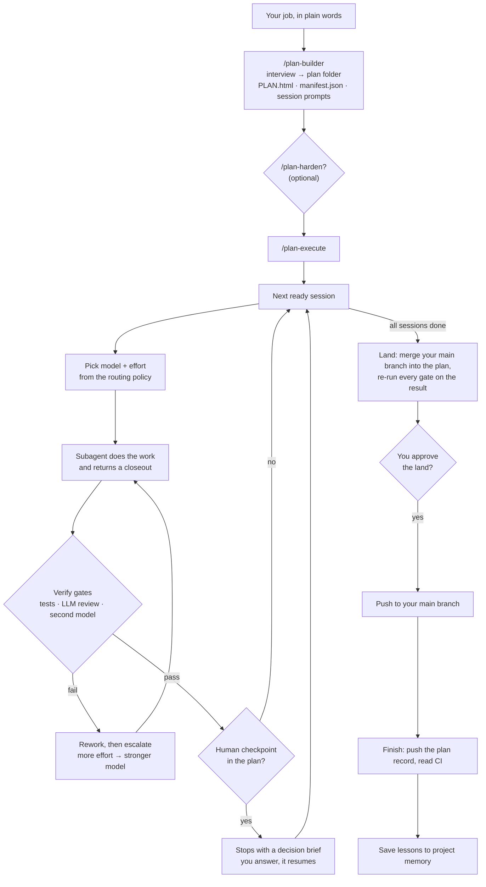

# The plan framework

Large jobs go wrong in one long chat. The context fills up and the agent loses
track. Work is called "done" without a check. And every step runs on the same
expensive model. The plan framework breaks a large job into **sessions**, runs
each session in its own subagent at the right model and effort, checks each
result before it counts, and stops for you where a human decision matters.

It is three skills that work together. They run in Claude Code, and a plan can
also run from OpenAI's Codex CLI (`--harness codex`); `/plan-harden` ships a
Codex version.

| Skill | What it does |
|---|---|
| `/plan-builder` | Interviews you about the job and writes a plan folder: a dashboard (`PLAN.html`), a dispatch graph (`manifest.json`) and one prompt per session. |
| `/plan-harden` | Optional. Stress-tests the plan before you run it: research, a grilling round, a two-model review (Claude and Codex), a premortem and lints. Then it edits the plan once. |
| `/plan-execute` | Runs the plan: dispatches each ready session, verifies it, and continues until it reaches a checkpoint, a blocker or the end. |

## How a plan runs

## The ideas behind it

**Sessions, not one long chat.** Each session has a narrow goal, a deliverable
and its own prompt. A fresh subagent runs it with clean context, so a long plan
does not degrade as it goes.

**You say what the work is; the executor picks the model.** Each session
carries a task class (`mechanical`, `standard_build`, `agentic_build`,
`deep_reasoning` or `linchpin`). At dispatch, `/plan-execute` looks the class up
in the [routing policy](../ARCHITECTURE.md) and picks the model and effort for
your provider. A rename runs on a cheap model; an architecture call runs on the
strongest one. You can pin a model for one session, with a written reason.

**"Done" means verified.** A session can declare verify gates: your tests, an
LLM code review at a level that fits its task class, or a review by a second
model (Codex). A subagent's own "done" does not count until the gates pass. A
failed gate sends the session back with the failure attached, a limited number
of times.

**Escalate on evidence, not on feel.** When a session fails twice at the same
root cause, the next attempt gets more effort, then a stronger model, along the
ladder in the routing policy. Nothing starts on the expensive model just
because a task feels hard.

**You decide where it matters.** The plan author puts human checkpoints where a
decision is irreversible or a matter of judgment. The run stops there with a
short brief: what was done, what needs deciding, the options. A session that
finds the plan itself is wrong can stop the run for a re-plan instead of
building on a bad assumption.

**Each plan on its own branch.** A plan can run on its own git branch and
worktree, so it never mixes with your other work. Sessions that touch separate
files can run in parallel, each in its own worktree. At the end, *land* merges
your main branch into the plan, re-runs every gate on the exact tree it will
push, and waits for your approval before it pushes.

**A dashboard you can open.** `PLAN.html` is one self-contained file. It shows
every session with its status, model and deliverable, a plain-language
explanation of the plan, and what comes next. It updates as the plan runs.

**Hands-off, but not unsupervised.** `/plan-execute <plan> --auto` keeps going
between sessions without asking, but still stops at every human checkpoint,
re-plan and blocker.

**Lessons carry over.** When a plan ends, the run writes what it learned to the
project's memory, and `/plan-harden` reads that memory when it checks the next
plan.

## A first plan

1. Install the [plan pipeline module](modules/plan-pipeline.md).
2. In a git repo, ask Claude: *"build a plan for <the job>"*. Answer the interview.
3. Open the `PLAN.html` it writes under `_plans/`.
4. Optional: run `/plan-harden` on the plan.
5. Run `/plan-execute _plans/<folder>`. Answer each checkpoint when it stops.

## Commands you will use

| Command | When |
|---|---|
| `/plan-builder` (or "build a plan for …") | Start a plan. Add `--harden` to run `/plan-harden` on it at the end. |
| `/plan-harden` | Check a plan before you run it. |
| `/plan-execute <plan>` | Run the plan until the next stop. |
| `/plan-execute <plan> --auto` | Run without pauses between sessions; human gates still stop it. |
| `/plan-execute <plan> --status` | See where the plan is, without running anything. |

## What it costs, and what it touches

- **Tokens.** Every session is a subagent run, and review gates are extra model
  runs. A ten-session plan with review gates is a real spend; the routing policy
  keeps cheap work on cheap models.
- **Your repo.** It writes `_plans/<slug>-<date>/` in the project, can create
  `plan/*` branches and worktrees, and at the end pushes to your main branch —
  only after you approve the land.
- **Codex.** Second-model reviews need the Codex CLI and send the reviewed code
  or plan to OpenAI. Without Codex, plans run with Claude-only reviews.

Install steps, files and cautions: [plan pipeline card](modules/plan-pipeline.md).
